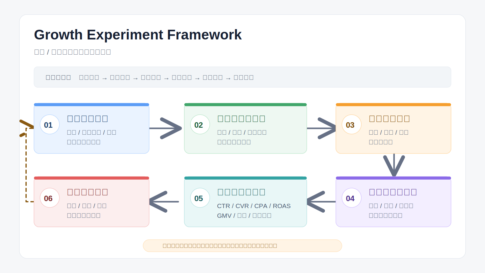

# Growth Experiment Framework

增长实验框架用于拆解新品 / 新业务增长问题，帮助将模糊的增长目标拆解为可执行的用户假设、场景假设、渠道策略、内容测试、转化承接和数据复盘机制。

它适用于新品冷启动、内容增长、用户增长、营销活动、平台运营和新业务验证等场景。



## 项目背景

很多新品或新业务在早期增长阶段，常见问题不是“没有动作”，而是动作过于分散：

- 不清楚目标用户是谁
- 不知道用户为什么会买
- 不知道应该优先测试哪个渠道
- 素材测试缺少明确假设
- 数据复盘只看结果，不看原因
- 失败后不知道下一步应该优化哪里

因此，这个框架的目标是：

> 将新品增长从“凭经验试错”，转化为“基于假设、实验、指标和复盘的系统化验证”。

## 框架总览

新品增长实验可以拆成 6 个步骤：

```text
01 业务问题定义
↓
02 用户与场景假设
↓
03 增长路径拆解
↓
04 内容 / 渠道 / 转化实验设计
↓
05 指标体系与判断标准
↓
06 复盘与下一步动作
```

## 仓库结构

```text
.
├── README.md
├── docs/
│   ├── framework-guide.md
│   └── experiment-review-checklist.md
├── templates/
│   ├── growth_experiment_plan_template.csv
│   └── user_scenario_hypothesis_template.csv
├── examples/
│   └── example_experiment_plan.csv
├── scripts/
│   └── validate_experiment_plan.py
├── assets/
│   └── growth-experiment-framework-preview.svg
└── LICENSE
```

## 快速使用

如果你只是想马上开始设计增长实验，推荐先下载实验计划模板，然后导入 Google Sheets 或 Excel。

### 方式 1：下载增长实验模板

1. 打开 [`templates/growth_experiment_plan_template.csv`](./templates/growth_experiment_plan_template.csv)。
2. 点击 GitHub 页面右上角的 `Download raw file` 下载 CSV 文件。
3. 打开 Google Sheets，选择 `文件 -> 导入 -> 上传`，上传这个 CSV。
4. 导入位置建议选择 `新建电子表格`。
5. 按行填写每一个实验，重点补齐 `增长假设`、`测试动作`、`核心指标`、`成功标准`、`下一步动作`。

Excel 用户可以直接双击打开 CSV，或在 Excel 中选择 `数据 -> 自文本/CSV` 导入。

### 方式 2：先拆用户与场景

如果当前还不清楚目标用户和测试方向，先下载：

[`templates/user_scenario_hypothesis_template.csv`](./templates/user_scenario_hypothesis_template.csv)

建议先填这几个字段：

| 字段 | 要回答的问题 |
|---|---|
| 用户人群 | 谁最可能需要这个产品 |
| 核心痛点 | 用户为什么会产生需求 |
| 触发场景 | 用户在什么时间、什么情境下行动 |
| 购买动机 | 用户为什么愿意买 |
| 购买阻力 | 用户为什么犹豫 |
| 内容角度 | 用什么表达方式触发行动 |

### 方式 3：校验实验计划

如果你已经整理好实验计划 CSV，可以用脚本检查必填字段是否为空：

```bash
python3 scripts/validate_experiment_plan.py examples/example_experiment_plan.csv output/invalid_rows.csv
```

脚本会输出：

- 缺失字段所在行
- 每行缺失了哪些关键字段
- 可用于后续补充的 `invalid_rows.csv`

## 01 业务问题定义

在开始任何增长动作之前，先明确：

- 当前业务阶段是什么？
- 这次增长目标是什么？
- 最大的不确定性是什么？
- 资源限制是什么？
- 成功和失败的判断标准是什么？

示例：

| 问题 | 示例 |
|---|---|
| 当前阶段 | 新品冷启动 / 早期验证 |
| 核心目标 | 验证新品是否具备可规模化获客潜力 |
| 关键不确定性 | 用户是否有明确痛点，是否愿意付费 |
| 资源限制 | 预算有限、素材有限、历史数据不足 |
| 成功标准 | 获客成本、转化率、内容反馈达到可继续测试标准 |

## 02 用户与场景假设

新品增长不是先问“投什么渠道”，而是先问：

- 谁会需要这个产品？
- 用户在什么场景下产生需求？
- 哪个痛点最容易触发行动？
- 用户为什么会犹豫？
- 哪种内容最能让用户相信？

推荐拆解方式：

| 用户人群 | 核心痛点 | 触发场景 | 购买动机 | 购买阻力 | 内容角度 |
|---|---|---|---|---|---|
| 示例用户 | 示例痛点 | 示例场景 | 示例动机 | 示例阻力 | 示例内容方向 |

## 03 增长路径拆解

将用户从“不知道产品”到“完成转化”的过程拆成不同阶段：

| 阶段 | 用户状态 | 核心问题 | 增长动作 |
|---|---|---|---|
| 认知 | 不知道产品 | 如何被看到 | 内容触达、达人、广告、搜索曝光 |
| 兴趣 | 开始关注 | 为什么继续看 | Hook、痛点、场景、结果前置 |
| 信任 | 开始犹豫 | 为什么相信 | 证言、案例、对比、机制解释 |
| 转化 | 准备行动 | 为什么现在买 | 落地页、价格、权益、CTA |
| 复盘 | 已有数据 | 哪里出问题 | 漏斗分析、素材复盘、用户反馈 |

## 04 实验设计

每个增长动作都应该对应一个明确假设。

不要只写：

```text
测试素材
```

建议写成：

```text
如果用户对某个痛点高度敏感，那么围绕该痛点的内容应该在点击率、互动率或加购率上高于普通卖点素材。
```

推荐实验表结构：

| 实验编号 | 增长假设 | 测试动作 | 核心指标 | 成功标准 | 下一步 |
|---|---|---|---|---|---|
| EXP-001 | 用户对场景痛点更敏感 | 测试 3 条痛点内容 | CTR / ATC | 高于账户均值 | 扩展同类素材 |
| EXP-002 | 用户缺乏信任影响转化 | 增加证言与对比内容 | CVR / CPA | CVR 提升 | 做证言素材矩阵 |

## 05 指标体系

指标需要分层判断，而不是只看最终转化。

| 层级 | 指标 | 判断什么 |
|---|---|---|
| 前链路 | CTR / Hook Rate / 互动率 | 内容是否吸引用户 |
| 中链路 | LPV / ATC / IC | 用户是否产生兴趣 |
| 后链路 | CVR / CPA / ROAS | 是否具备转化效率 |
| 业务层 | GMV / 毛利 / 回本周期 | 是否值得继续放大 |
| 内容层 | 素材生命周期 / 复用率 | 是否能沉淀内容资产 |

## 06 复盘与下一步动作

复盘的重点不是“表现好不好”，而是判断下一步应该做什么。

| 结果表现 | 可能原因 | 下一步动作 |
|---|---|---|
| CTR 高，CVR 低 | 内容吸引人，但信任、价格或落地页不足 | 优化落地页、补充证言、调整权益 |
| CTR 低，CVR 高 | 内容吸引力弱，但进入后的用户意图强 | 优化 Hook，扩展内容角度 |
| ATC 高，购买低 | 用户有兴趣，但购买阻力强 | 优化价格、物流、支付、信任信息 |
| ROAS 高但跑不动 | 素材或受众规模有限 | 扩展素材矩阵，测试更多场景 |

## 使用场景

- 新品冷启动
- 新业务增长验证
- 内容增长实验
- 用户获取策略设计
- 广告素材测试
- 营销活动复盘
- 渠道策略拆解
- 增长团队内部协作

## 项目展示能力

- 将模糊增长问题拆解为可执行实验
- 从用户、场景、渠道、内容、转化和数据多个维度设计增长路径
- 用假设和指标驱动增长动作，而不是凭感觉试错
- 将增长复盘沉淀为可复用的方法论和工作流
- 连接内容、投放、转化和业务结果

## 后续优化方向

- 增加新品增长实验模板
- 增加不同业务阶段的指标判断标准
- 增加内容测试矩阵模板
- 增加实验复盘模板
- 增加真实案例示例
- 增加可视化增长实验看板
- 与内容评分系统、素材 Brief 系统联动

## License

MIT License. 仅供学习、研究与作品集展示使用。
